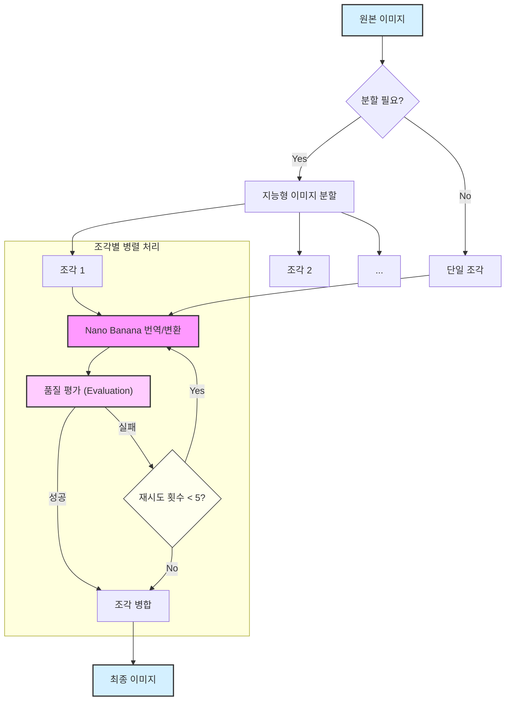

# Nano Banana Image Translator (나노 바나나 이미지 번역기)

이 프로젝트는 **Gemini 3.1 Flash Image (Nano Banana 2) 모델**을 사용하여 대형 또는 세로로 긴 이미지의 변환 및 번역을 수행하는 파이썬 기반 도구입니다. 대형 원본 이미지를 더 작은 조각(chunk)으로 지능적으로 분할하고, 각 조각을 Gemini API로 보내 처리한 다음, 결과를 매끄럽게 다시 병합합니다.

프롬프트를 수정하여 이미지 내 텍스트 번역 등 다른 목적으로도 쉽게 변환할 수 있습니다. (예: `KO_EN_prompt.txt` 사용)

### 시각적 예시

| 원본 이미지 (한국어) | 변환 후 (영어) |
| :---: | :---: |
|  |  |

**적용된 한영 번역 프롬프트 (`prompt/KO_EN_prompt.txt`):**
*(파일 내용은 영문으로 유지되지만, 사용자의 쉬운 이해를 위해 아래에 한글 설명을 첨부합니다.)*

> ... (영문 프롬프트 내용) ...
> **추가 지침:** 인식이 어려운 작은 글씨는 번역하지 않고 원래 형태 그대로 둡니다.

### 시각적 예시 (영한 번역 - Google Pixel)

| 원본 이미지 (영어) | 변환 후 (한국어) |
| :---: | :---: |
|  |  |

**적용된 영한 번역 프롬프트 (`prompt/EN_KO_prompt.txt`):**
*(파일 내용은 영문으로 유지됩니다.)*

### 시각적 예시 (인상주의 화풍 변환 - Google Pixel)

| 원본 이미지 (영어) | 변환 후 (인상주의 유화) |
| :---: | :---: |
|  |  |

**적용된 인상주의 유화 프롬프트 (`prompt/prompt.txt`):**
*(파일 내용은 영문으로 유지되며, 사용자의 쉬운 이해를 위해 아래에 한글 요약을 첨부합니다.)*

> **프롬프트 요약:** 이미지를 대담하고 표현력 있는 인상주의 유화 스타일로 변환하되, 색상과 텍스트 무결성을 유지합니다.

## 주요 기능

*   **지능형 이미지 분할**: 가장 적절한 분할 지점을 찾아 텍스트나 복잡한 영역이 잘리는 것을 방지합니다. 원본 너비 대비 16:9 화면비를 기준으로 최대 조각 높이를 동적으로 계산합니다.
*   **대형 이미지 지원**: 이미지를 관리 가능한 조각으로 나누어 API에 전송하므로 길이에 제한 없이 처리가 가능합니다.
*   **Gemini 3.1 Flash Image (Nano Banana 2) 통합**: 고품질 이미지-이미지(Image-to-Image) 작업을 위해 강력한 **Gemini 3.1 Flash Image (Nano Banana 2) 모델**을 활용합니다.
*   **병렬 처리**: 빠른 실행을 위해 여러 이미지 조각을 동시에 처리합니다(4개 워커).
*   **강력한 오류 처리**: 안정성을 위해 API 호출 시 자동 재시도 로직(최대 5회)을 포함합니다.
*   **조각별 실시간 품질 평가 및 재시도**: 번역 작업의 경우, 각 조각이 처리된 즉시 품질 평가(Evaluation)를 수행합니다. 평가가 실패할 경우 해당 조각에 대해 최대 5회까지 번역을 재시도하여 안정적인 번역 품질을 보장합니다.
*   **매끄러운 병합**: 처리된 조각들을 세로로 다시 이어 붙여 하나의 완성된 최종 이미지를 생성합니다. 병합 전 모든 조각이 원본 너비와 정확히 일치하도록 고품질 Lanczos 리샘플링을 적용합니다.
*   **번역 평가 도구**: 원본 이미지와 번역된 이미지(또는 조각)를 비교하여 품질을 검증하는 `evaluator.py` 모듈을 제공합니다 (Gemini Pro Vision 모델 사용).
*   **작은 글씨 번역 제외**: 해상도가 낮거나 크기가 작아 인식이 어려운 글씨는 번역하지 않고 원본 이미지를 유지하도록 지침이 강화되었습니다.
*   **디버깅 도구**: 문제 해결을 위해 처리 전/후의 중간 이미지 조각들을 별도 디렉토리에 저장합니다.

## 작동 원리

전반적인 프로세스는 다음과 같이 세 단계로 이루어집니다:



1.  **분할 (Split)**: 입력 이미지를 분석하여 높이가 동적으로 계산된 최대치를 초과하는 경우 세로로 분할합니다. 분할 알고리즘(`find_best_cut_position`)은 단순한 영역(예: 단색 배경)을 찾아 텍스트와 같은 복잡한 요소가 훼손되지 않도록 분할합니다.
2.  **변환 및 평가 (Transform & Evaluate)**: 각 조각은 개별적으로 **Gemini 3.1 Flash Image (Nano Banana 2) 모델**에 전송되어 특정 프롬프트(예: 번역 또는 화풍 변환)에 따라 처리됩니다. 처리 직후 품질 평가(Evaluation)가 수행되며, 실패 시 최대 5회 재시도합니다. 이 작업은 병렬로 효율적으로 진행됩니다.
3.  **병합 (Merge)**: 변환 및 평가가 완료된 조각들을 다시 세로로 병합하여 하나의 최종 이미지를 생성합니다. 필요한 경우 병합 전 Lanczos 리샘플링을 통해 너비를 맞춥니다.

## 설정 및 사용법

### 필수 요건 (Prerequisites)

*   Python 3.x
*   Google Cloud SDK 인증 완료 (`gcloud auth application-default login`)
*   Vertex AI API가 활성화된 Google Cloud 프로젝트
*   필수 파이썬 라이브러리: `Pillow`, `google-genai`

### 설치 (Installation)

1.  저장소를 복제하거나 소스 코드를 다운로드합니다.
2.  가상환경(venv)을 생성하고 활성화합니다.
3.  필요한 파이썬 패키지를 설치합니다:
    ```bash
    pip install -r requirements.txt
    ```

### 스크립트 실행 (Running the Script)

터미널에서 `image_translator.py` 스크립트를 실행합니다:

```bash
python image_translator.py <input_image_path> <output_image_path> --project_id <your-gcp-project-id> --prompt_file <prompt-file-name>
```

**주요 인자 (Arguments):**

*   `input_image_path`: 원본 이미지 파일 경로 (예: `original_product_image/google_nest_ko.png`)
*   `output_image_path`: 최종 결과 이미지가 저장될 경로 (예: `translated_product_image/google_nest_en.png`)
*   `--project_id`: (옵션) Google Cloud 프로젝트 ID. 별도로 지정하지 않으면 환경 변수 또는 `gcloud` 설정을 자동으로 탐지합니다.
*   `--prompt_file`: (옵션) 사용할 프롬프트 파일 이름 (디렉토리 경로가 포함될 수 있습니다. 셜: `prompt/KO_EN_prompt.txt`). 기본값은 `prompt.txt` 입니다.

## 파일 구조

*   `image_translator.py`: 이미지 분할, 처리, 평가, 병합을 컨트롤하는 메인 스크립트입니다.
*   `standalone_image_splitter.py`: 이미지를 지능적으로 조각(chunk)으로 나누는 로직이 담긴 모듈입니다.
*   `evaluator.py`: 번역된 이미지 조각의 품질을 원본과 비교 평가하는 모듈입니다 (Gemini 2.5 Pro 사용).
*   `prompt/`: 프롬프트 파일들이 위치한 디렉토리입니다.
    *   `prompt.txt`: 기본 프롬프트 (인상주의 유화 화풍 변환용)
    *   `KO_EN_prompt.txt`: 한영 번역 전용 프롬프트
    *   `KO_JA_prompt.txt`: 한일 번역 전용 프롬프트
*   `original_product_image/`: 샘플 입력 이미지들을 저장하는 디렉토리입니다.
*   `translated_product_image/`: 결과 이미지들이 저장되는 디렉토리입니다.
*   `debug_chunks/`: 분할된 원본 조각들이 디버깅용으로 저장되는 디렉토리입니다.
*   `debug_translated_chunks/`: 처리된(번역된) 조각들이 디버깅용으로 저장되는 디렉토리입니다.
